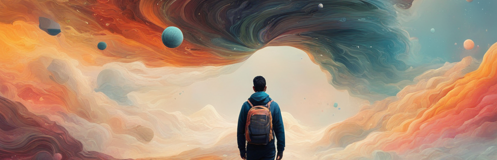

  

<h1 align="center"></h1>

<h3 align="center">I am a passionate Software Developer and Full Stack Developer, with a curiosity to explore and seek new adventures in the world of technology.</h3> 

🔭 I’m currently working on NextJs Project

🌱 I’m currently learning **NextJs**

👨‍💻 All of my projects are available at [https://github.com/Rashminda121](https://github.com/Rashminda121)

💬 Ask me about  **Android / Software Applications**

📫 How to reach me **rashminda121@gmail.com**

📄 Know about my experiences [https://rashminda121.github.io/porfolio2/](https://rashminda121.github.io/porfolio2/)

  

<h3 align="center">Connect With Me</h3>

 

 

